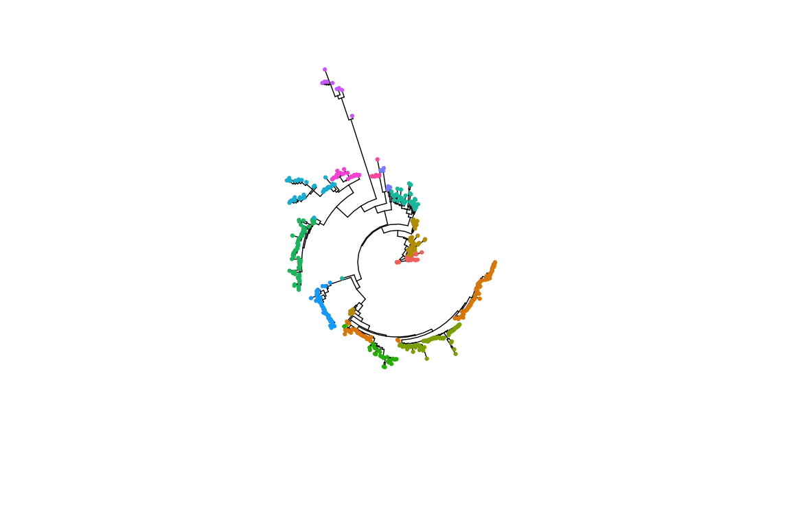
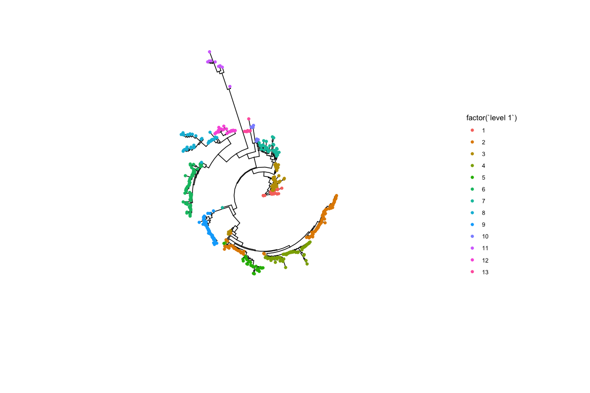

<!-- README.md is generated from README.Rmd. Please edit that file -->
[](https://travis-ci.org/gtonkinhill/rhierbaps)

rhierbaps
=========

Installation
------------

`rhierbaps` is currently available on github. It can be install with `devtools`

``` r
install.packages("devtools")

devtools::install_github("gtonkinhill/rhierbaps")
```

If you would like to also build the vignette with your installation run:

``` r
devtools::install_github("gtonkinhill/rhierbaps", build_vignettes = TRUE)
```

Quick Start
-----------

Run hierBAPS.

``` r
# devtools::install_github('gtonkinhill/rhierbaps')
library(rhierbaps)

fasta.file.name <- system.file("extdata", "seqs.fa", package = "rhierbaps")
snp.matrix <- load_fasta(fasta.file.name)
hb.results <- hierBAPS(snp.matrix, max.depth = 2, n.pops = 20, quiet = TRUE)
head(hb.results$partition.df)
#>   Isolate level 1 level 2
#> 1       1       1       1
#> 2       2       1       1
#> 3       3       1       1
#> 4       4       2       5
#> 5       5       3       9
#> 6       6       3       9
```

The hierBAPS algorithm was introduced in (Cheng et al. 2013) and provides a method for hierarchically clustering DNA sequence data to reveal nested population structure. Previously the algorithm was available as a compiled MATLAB binary. We provide a convenient R implementation and include a number of useful additional options including the ability to use multiple cores, save the log marginal likelihood scores and run the algorithm until local convergence. Furthermore, we provide a wrapper to a ggtree plotting function allowing for easy exploration of sub-clusters.

------------------------------------------------------------------------

**Things to keep in mind before running hierBAPS**

1.  hierBAPS uses a uniform prior for K.
2.  The prior for a site depend on the available snps, i.e. if a site only has 'AC', then the prior for 'ACGT' is (1/2, 1/2, 0, 0)
3.  The initial sequence partition is generated using hierarchical clustering with complete linkage based on a Hamming distance matrix.
4.  The initial number of populations should be set much higher than the expected number of populations.
5.  More search rounds of the algorithm can be added using the `n.extra.rounds` parameter.
6.  To get reproducible results the seed in R must be set.

Libraries
---------

``` r
library(rhierbaps)
library(ggtree)
library(phytools)

set.seed(1234)
```

Loading data
------------

We first need to load a multiple sequence alignment in fasta format. We can then generate the required SNP matrix.

``` r
fasta.file.name <- system.file("extdata", "seqs.fa", package = "rhierbaps")
snp.matrix <- load_fasta(fasta.file.name)
```

If you wish to include singleton SNPs (those that appear in only one isolate) then set `keep.singletons=FALSE`. However, this is currently advised against as these SNPs lead to a higher number of parameters in the model and do not provide information about shared ancestry.

Running hierBAPS
----------------

We now need to decide how many levels of clustering we are interested in and the number of initial clusters to start from. It is a good idea to choose `n.pops` to be significantly larger than the number of clusters you expect.

To run hierBAPS with 2 levels and 20 initial clusters we run

``` r
hb.results <- hierBAPS(snp.matrix, max.depth = 2, n.pops = 20, quiet = TRUE)
head(hb.results$partition.df)
#>   Isolate level 1 level 2
#> 1       1       1       1
#> 2       2       1       1
#> 3       3       1       1
#> 4       4       2       5
#> 5       5       3       9
#> 6       6       3       9
```

This produces a list which includes a data frame indicating the resulting partition of the isolates at the difference levels. The isolate names in this data frame are taken from the fasta headers and thus for plotting it is important that these match the isolate names in any tree used later. This function also outputs the log marginal likelihoods at the different levels of clustering.

hierBAPS can also be run until the algorithm converges to a local optimum as

``` r
hb.results <- hierBAPS(snp.matrix, max.depth = 2, n.pops = 20, n.extra.rounds = Inf, 
    quiet = TRUE)
```

We can also change the minimum cluster size as

``` r
hb.results <- hierBAPS(snp.matrix, max.depth = 2, n.pops = 20, min.cluster.size = 10, 
    quiet = TRUE)
```

Plotting results
----------------

To plot the results it is useful to consider a tree of the same isolates. We clustered the example isolates using Iqtree (Kalyaanamoorthy et al. 2017). The ggtree (Yu et al. 2017) package then allows us to plot the results.

First we need to load the newick file.

``` r
newick.file.name <- system.file("extdata", "seqs.fa.treefile", package = "rhierbaps")
iqtree <- phytools::read.newick(newick.file.name)
```

A simple coloured tree allows us to see the top level cluster assignment from hierBAPS.

``` r
gg <- ggtree(iqtree, layout = "circular")
gg <- gg %<+% hb.results$partition.df
gg <- gg + geom_tippoint(aes(color = factor(`level 1`)))
gg
```


As there are many more clusters at the second level using colours to distinguish them can get confusing. Instead we can label the tips with their corresponding colours.

``` r
gg <- ggtree(iqtree, layout = "circular", branch.length = "none")
gg <- gg %<+% hb.results$partition.df
gg <- gg + geom_tippoint(aes(color = factor(`level 1`)))
gg <- gg + theme(legend.position = "right")
gg <- gg + scale_color_discrete(name = "level 1")
gg <- gg + geom_tiplab(aes(label = `level 2`), size = 1, align = TRUE, offset = 1)
gg
```



We can also zoom into a particular top level cluster to get a better idea of how it is partitioned at the lower level. As an example we zoom in on sub cluster 9 at level 1.

``` r
plot_sub_cluster(hb.results, iqtree, level = 1, sub.cluster = 9)
```



Finally, we can inspect the log marginal likelihoods given for each level.

``` r
hb.results$lml.list
#> $`Depth 0`
#>         1 
#> -50858.92 
#> 
#> $`Depth 1`
#>          1          2          3          4          5          6 
#> -2121.8602 -4012.3594 -4237.7634 -3095.1866 -1525.7361 -3180.7573 
#>          7          8          9         10         11         12 
#> -4015.5022 -2104.5238 -1736.0193  -779.7693  -810.5962  -688.5221 
#>         13 
#>  -163.3203
```

Saving results
--------------

For runs that take a long time it is a good idea to save the output. We can save the partition file as

``` r
write.csv(hb.results$partition.df, file = "hierbaps_partition.csv", col.names = TRUE, 
    row.names = FALSE)

save_lml_logs(hb.results, "hierbaps_logML.txt")
```

References
----------

Cheng, Lu, Thomas R Connor, Jukka Sirén, David M Aanensen, and Jukka Corander. 2013. “Hierarchical and Spatially Explicit Clustering of DNA Sequences with BAPS Software.” *Mol. Biol. Evol.* 30 (5): 1224–8. doi:[10.1093/molbev/mst028](https://doi.org/10.1093/molbev/mst028).

Kalyaanamoorthy, Subha, Bui Quang Minh, Thomas K F Wong, Arndt von Haeseler, and Lars S Jermiin. 2017. “ModelFinder: Fast Model Selection for Accurate Phylogenetic Estimates.” *Nat. Methods* 14 (6): 587–89. doi:[10.1038/nmeth.4285](https://doi.org/10.1038/nmeth.4285).

Paradis, Emmanuel, Julien Claude, and Korbinian Strimmer. 2004. “APE: Analyses of Phylogenetics and Evolution in R Language.” *Bioinformatics* 20 (2): 289–90. doi:[10.1093/bioinformatics/btg412](https://doi.org/10.1093/bioinformatics/btg412).

Revell, Liam J. 2012. “Phytools: An R Package for Phylogenetic Comparative Biology (and Other Things).” *Methods Ecol. Evol.* 3 (2). Blackwell Publishing Ltd: 217–23. doi:[10.1111/j.2041-210X.2011.00169.x](https://doi.org/10.1111/j.2041-210X.2011.00169.x).

Yu, Guangchuang, David K Smith, Huachen Zhu, Yi Guan, and Tommy Tsan-Yuk Lam. 2017. “Ggtree: An R Package for Visualization and Annotation of Phylogenetic Trees with Their Covariates and Other Associated Data.” *Methods Ecol. Evol.* 8 (1): 28–36. doi:[10.1111/2041-210X.12628](https://doi.org/10.1111/2041-210X.12628).
